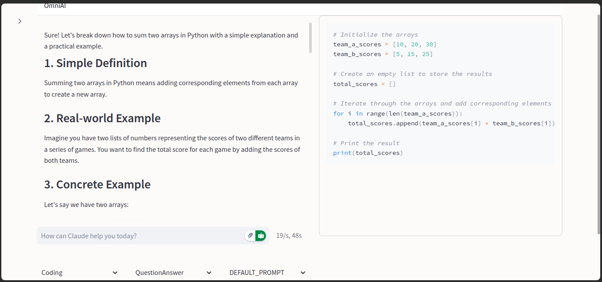

# 🤖 omni-ai

Transform your AI interactions with omni-ai, an innovative open-source chatbot system that brings Claude-like capabilities to everyone using Hugging Face's most powerful open models. Built around the cutting-edge Qwen2.5-70B, our system delivers enterprise-grade conversational AI without the enterprise price tag.

## 🌟 Why omni-ai?

- 🧠 Powered by state-of-the-art Qwen2.5-70B model - the most capable open-source alternative to proprietary AI
- 🎭 Implements Claude-inspired prompting techniques for human-like interactions
- 🔗 Seamless integration with HuggingFace's ecosystem
- 🎨 Beautiful artifact rendering similar to Claude's interface
- 🌐 Built-in web search capabilities for real-time knowledge
- 📚 Multiple specialist modes: Coding, Research, Analysis, and more
- 💡 Smart context handling and conversation memory
- 🚀 Fast response times with streaming output
- 💰 completely FREE to use with open source models

## 🎯 Perfect For:
- 💻 Developers seeking a powerful coding assistant
- 📊 Data scientists needing analysis help
- 🔍 Researchers requiring smart search integration
- 🎓 Students looking for learning support
- 🏢 Teams wanting Claude-like features without the cost

## ✨ Features

- 🎯 Multiple AI models support
- 💬 Interactive chat interface
- 🔍 Web search integration
- 📱 Clean and responsive UI
- 🎨 Beautiful artifact rendering
- 🤝 Multiple agent types for different use cases

## 🚀 Installation

```bash
pip install aichatlite
```

## 📖 Quick Start

Launch the UI with a single command:

```bash
claude-web
```

This will start the web interface on port 8501.

## 🎮 Available Models

| Model Type | Description |
|------------|-------------|
| 🖥️ Coding | Qwen2.5-Coder-32B-Instruct - Specialized for programming tasks |
| 🌐 General | Qwen2.5-72B-Instruct - Best for general-purpose use |
| 🔮 Preview | QwQ-32B-Preview - Latest experimental features |
| 💭 Conversational | Hermes-3-Llama-3.1-8B - Optimized for natural dialogue |
| 📱 Mini | Phi-3.5-mini-instruct - Lightweight model for basic tasks |

## 🤝 Agent Types

- QuestionAnswer: Direct response to queries
- Reasoning: In-depth analytical responses
- GoogleSearchAI: Web-enhanced responses
- SearchAI: Alternative search implementation
- GoogleSearch: Basic web search integration
- DeepGoogleSearch: Advanced web research capabilities

## 📸 UI Screenshots

Here's how the interface looks in action:




## 🗺️ Roadmap

- ✅ Feature 1: Integrate hugchat and launch UI
- ✅ Feature 2: Web search integration (available in aichatlite-web-release branch)
- 🔄 Feature 3: PDF Chat integration
- 🔄 Feature 4: AI Researcher capabilities (arxiv, google scholar, etc.)

## 💡 Advanced Usage

### Selecting Models
Choose from different models based on your needs:
- Use Coding model for programming tasks
- General model for everyday queries
- Preview model for testing new features
- Mini model for quick, simple responses

### Agent Types
Different agents for different tasks:
- QuestionAnswer: Quick, direct responses
- Reasoning: Detailed analytical answers
- Various search options for web-enhanced responses

## AVAILABLE MODELS

- "Qwen/Qwen2.5-72B-Instruct"
- "Qwen/QwQ-32B-Preview"
- "Qwen/Qwen2.5-Coder-32B-Instruct"
- "NousResearch/Hermes-3-Llama-3.1-8B"
- "microsoft/Phi-3.5-mini-instruct"
- "meta-llama/Llama-3.1-8B-Instruct"
- "meta-llama/Llama-3.2-1B-Instruct"
- "meta-llama/Llama-3.2-3B-Instruct"
- "01-ai/Yi-1.5-34B-Chat"
- "codellama/CodeLlama-34b-Instruct-hf"
- "google/gemma-1.1-7b-it"
- "google/gemma-2-2b-it"
- "google/gemma-2-9b-it"
- "google/gemma-2b-it"
- "HuggingFaceH4/starchat2-15b-v0.1"
- "HuggingFaceH4/zephyr-7b-alpha"
- "HuggingFaceH4/zephyr-7b-beta"
- "meta-llama/Llama-2-7b-chat-hf"
- "meta-llama/Meta-Llama-3-8B-Instruct"
- "microsoft/DialoGPT-medium"
- "microsoft/Phi-3-mini-4k-instruct"
- "mistralai/Mistral-7B-Instruct-v0.2"
- "mistralai/Mistral-7B-Instruct-v0.3"
- "mistralai/Mixtral-8x7B-Instruct-v0.1"
- "NousResearch/Nous-Hermes-2-Mixtral-8x7B-DPO"
- "Qwen/Qwen2.5-1.5B-Instruct"
- "Qwen/Qwen2.5-3B-Instruct"
- "tiiuae/falcon-7b-instruct"
- "uschreiber/llama3.2"


## Ui Progress


## 📝 License

[Add your license information here]
