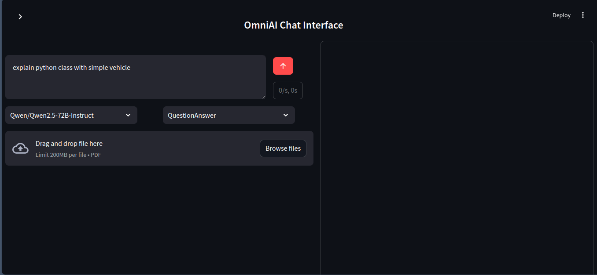
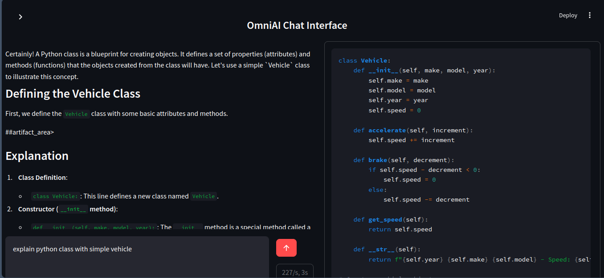
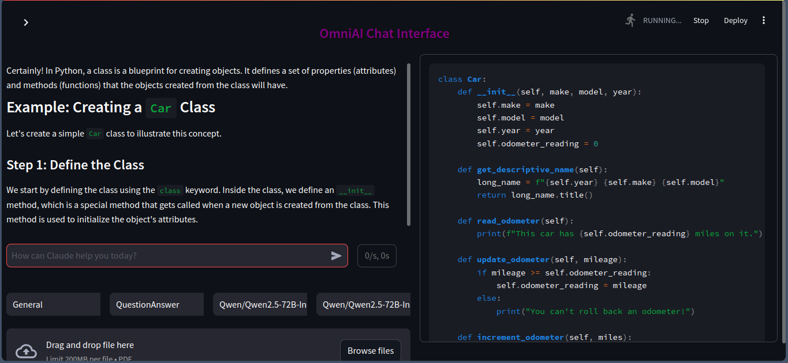

# omni-ai

A chatbot system using huggingchat with most capable model qwen2.5-70B model , to achieve similar featurs of claude.

## Future Plan

- [x] Feature 1: Integrate hugchat and start ui
- [ ] Feature 2: Integrate websearch
- [ ] Feature 3: PDF+Chat
- [ ] Feature 4: Ai Researcher on specific topic or request ( arxiv,google etc..)